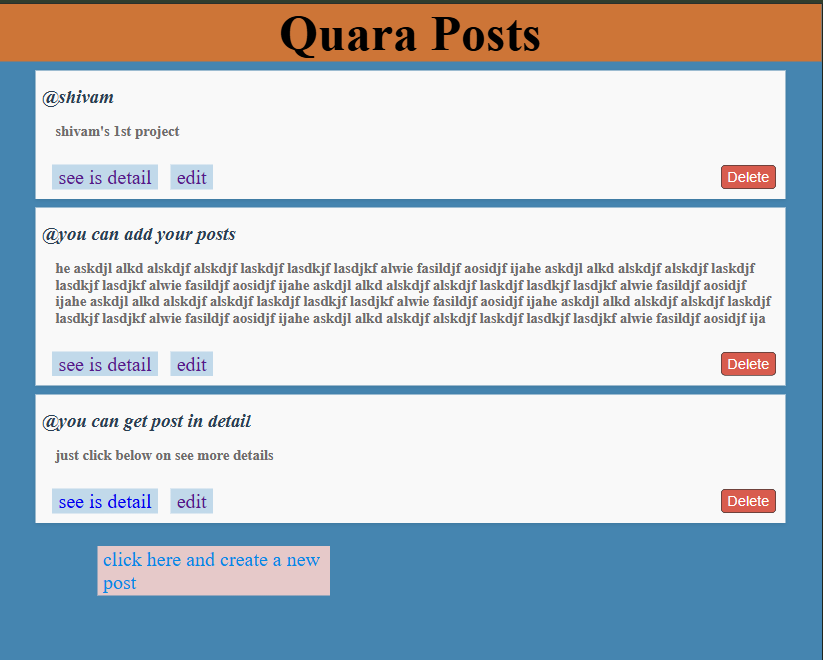

# express-ejs-posts
Mini blog-like application where users can create, view, edit, and delete posts. Built with Node.js, Express.js, and EJS templating engine.

# express-ejs-posts

A **mini blog-like application** where users can create, view, edit, and delete posts. Built with **Node.js**, **Express.js**, and **EJS** templating engine. This project uses an in-memory `posts` array to store posts (no database required).

## Features

- Create a new post with a **username** and **content**  
- View a list of all posts  
- View post details  
- Edit an existing post  
- Delete a post  

## Tech Stack

- **Node.js** – JavaScript runtime  
- **Express.js** – Web framework for Node.js  
- **EJS** – Embedded JavaScript templating engine  
- **HTML/CSS** – Frontend templates  

## 🚀 Live Demo
Check out the project here: [Express EJS Posts](https://express-ejs-posts.onrender.com)

Usage
· Navigate to the homepage to see all posts.
. Click Create Post to add a new post.
· Click Edit on a post to modify it.
· Click Delete to remove a post.
· Click on a post title to view its details.
Notes
. This project stores posts only in memory, so all data will be lost when the server restarts.
· Perfect for learning Node.js, Express, and EJS templating.
License
This project is open source and available under the MIT License .

#screenshot

